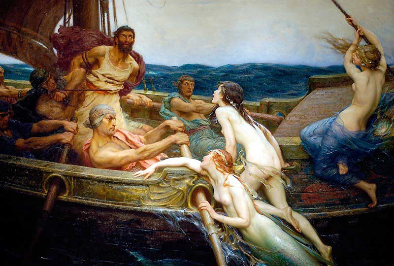

# Очарование перспективами

Когда‑то в старых сказках короли теряли волю не от вражеских чар, а от тонкого обольщения. В их дворы приходили странствующие мудрецы и обещали горы золота, элексир вечной молодости и секрет вечной власти. Король слушал, забывая войска и казну, ведь слова мудрецов звучали как пение птиц из сказочных краёв свободных от забот и опасностей. Тот, кто говорил убедительно, казался гением. И пока монарх грезил о будущем, реальность тихо распадалась на куски.

Современный руководитель переживает ту же историю, только вместо странствующих мудрецов перед ним выступают апостолы новых технологий, победными речами и красочными презентациями рисующие сияющее будущее. Он, подобно зачарованному правителю, перестает делать различия между знанием и красноречием, между реальной компетенцией и мастерством внушения. Очарование перспективами лишает его способности трезво смотреть на людей и задачи, превращая управление в игру ожиданий и иллюзий.

# Песнь сирен

Песнь сирен - в мифологии звук или мелодия, которую издают мифические существа сирены, способные своим пением очаровывать, заманивать и даже губить людей. В древнегреческих мифах сирены описываются как полуженщины-полуптицы, жившие на скалах в море и привлекавшие моряков своим завораживающим голосом, заставляя их забыть обо всем и разбиваться о камни. Песнь сирен обладала силой манипулировать сознанием, порой приводя к безумию и смерти. Эта мелодия была одновременно сладостной и губительной, символизируя соблазн и опасность, поэтому в средневековой традиции сирен часто связывали с искушениями души.

Современная «песнь сирен» - это рассказы о новых прорывных технологиях, которые сулят невероятные возможности. Эти песни звучат как заманчивые обещания о будущем, где искусственный интеллект, глобальные сети и передовые разработки обещают изменить жизнь и открыть дверь в фантастическое будущее.

## Иллюзии ваши - деньги наши

Речь в статье пойдёт об ошибке руководителя, которая выражается в очаровании сотрудниками, которые рассказывают о новых и перспективных (почти волшебных) технологиях, достижениях и прорывах известных компаний.

> Часто у очарованного руководителя возникает иллюзия высокой компетенции рассказчика.

Руководитель воспринимает рассказы о таких успехах как подтверждение своей возможности достичь аналогичных результатов, не сомневаясь в реалистичности этих заявлений и не проверяя фактическое соответствие ресурсов и возможностей команды. Это приводит к необоснованно завышенным ожиданиям и неверному планированию.

> Такой руководитель подвержен интеллектуальной манипуляции, когда он очарован технологическими терминами, модными трендами и успехами крупных игроков и не учитывает уникальных условий своей организации.

Это создает ложное представление о готовности команды повторить «волшебные» прорывы и вынуждает принимать решения, основанные на иллюзиях, а не на объективном анализе. В итоге проект оказывается неадекватно оценен по срокам, ресурсам и рискам, что увеличивает вероятность провала.

> Подобная ситуация свидетельствует о недостатке у руководителя критического мышления и, что он не использует адекватных методов проверки компетенций и реального положения дел.

Важно, чтобы руководитель умел отделять маркетинговую или рекламную риторику от реальной технической и организационной способности команды. Он должен требовать конкретных доказательств достижений и доказетельств способности работать с новыми технологиями, а не принимать на веру «истории побед».

**Для избежания этой ошибки рекомендуется:**

- Критически оценивать информацию о новых технологиях и успехах, запрашивать доказательства и конкретные примеры результатов.

- Определять реальные возможности и компетенции своей команды с помощью объективных метрик.

- Балансировать оптимизм и реализм, базируясь на фактических возможностях команды.

- Избегать принятия решений под влиянием эмоций и модных трендов без глубокой экспертизы.

> Руководитель должен быть не просто вдохновленным слушателем историй о прорывах, а строгим аналитиком, способным отделять фантазии и маркетинг от реальных возможностей технологий, продуктов, реальных способностей команды и объективных условий для успеха.

Это позволяет избежать рисков переоценки и неготовности к выполнению заданий на заявленном уровне.

## Как распознать "околдованного"

Эффект очарования у руководителя можно распознать по нескольким признакам, связанным с его поведением и принятием решений:

- Чрезмерный энтузиазм и вера в достижения, о которых рассказывают отдельные сотрудники, без критического анализа или проверки фактов. Руководитель склонен принимать «волшебные истории» за истинные, без глубокого анализа, и принимать решение об использовании новых технологий даже если у команды нет достаточных ресурсов или опыта.

- Частое использование модных технологических терминов и трендов в обсуждениях, когда руководитель больше фокусируется на впечатлении и «громких словах», чем на реальных результатах и практических шагах.

- Склонность быстро менять стратегию под впечатлением от «новых прорывных технологий» или успешных кейсов других компаний, не учитывая долгосрочные риски и внутренние возможности организации.

- Отсутствие устойчивой критики и сомнений в отношении предложений, когда любые вопросы или сомнения со стороны команды игнорируются или воспринимаются как лишняя бюрократия.

- Решения принимаются эмоционально и импульсивно, исходя из желания «успеть» или «повторить успех», а не на основе детального анализа и планирования.

- Руководитель демонстрирует предпочтение сотрудникам, которые максимально эффектно рассказывают о своих достижениях, формируют впечатление компетентности, даже если реальные показатели работ этому не соответствуют.

Распознавание данного эффекта требует наблюдения за поведением руководителя в повседневных рабочих ситуациях, а также анализа принимаемых им решений на предмет баланса между обоснованностью и эмоциями.

Чтобы не столкнутся с негативными последствиями этого эффекта, важно создать культуру открытого обсуждения и критического мышления, когда команда не боится высказывать сомнения и задавать сложные вопросы, а руководитель открыт к ним и не поддается влиянию иллюзий.