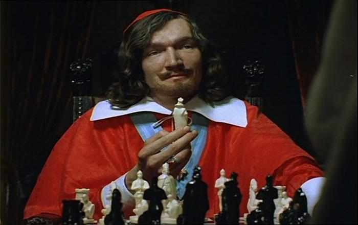

# Манипулятивный стратег

Манипулятивный стратег - это не просто "сложный руководитель", а особый тип управленца, который использует стратегическое мышление как инструмент скрытого контроля над людьми, а не как способ совместного движения к целям. Такой лидер мыслит ходами, как в шахматах, но фигурами для него оказываются не абстрактные ресурсы, а живые люди, их мотивация, страхи и профессиональная репутация.

Внешне всё может выглядеть как "стратегическое лидерство": обсуждения видения, поиски синергий, разговоры о доверии и ценностях. Но за фасадом общего блага скрывается прицельная работа по подгибанию реальности под свои интересы - через дозирование информации, культивирование зависимости, создание управляемой неопределённости и игры на амбициях. Такой стиль действительно способен давать яркие краткосрочные результаты, впечатляющие отчётами и презентациями, но при этом он системно подтачивает то, на чём держится живая организация: доверие, субъектность, инициативу и устойчивость людей.

Этот текст - попытка разобрать, как именно устроен такой тип руководства, по каким поведенческим маркерам его можно распознать и чем он отличается от жёсткого, но честного стратегического менеджмента. Речь пойдёт не о "психологическом портрете злодея", а о воспроизводимом управленческом паттерне, который легко маскируется под эффективность и "стратегичность", пока не начинаются сбои в ключевых людях и процессах.

И, конечно, все совпадения с реальными людьми, организациями и особенно начальниками - абсолютно случайны, ведь мы же знаем, что в реальной жизни всё совсем не так.

# Не очень серый кардинал

Манипулятивный стратег - это руководитель, который использует стратегическое мышление не для совместного достижения целей с командой, а для скрытого управления людьми в своих интересах, часто за счёт их автономии и благополучия. Такой стиль может давать краткосрочный результат, но системно разрушает доверие, субъектность и устойчивость организации.

Манипулятивный стратег строит долгосрочную линию влияния на людей, в которой цели, мотивы и реальные критерии успеха скрыты от большинства участников. Он может говорить о "командной работе" и "общем деле", но ключевые параметры игры известны только ему самому или узкому кругу доверенных лиц. Для подчинённых путь разбит на короткие задачи, каждая из которых выглядит разумно, но общая траектория и цена решений остаются непрозрачными.

В отличие от открытого стратегического лидера, который делится контекстом и вовлекает людей в обсуждение гипотез и рисков, манипулятивный стратег сознательно удерживает власть через дефицит информации и неравенство в доступе к смыслу. Внешне он может выглядеть харизматичным, заботливым, иногда даже "мудрым наставником", но фактически воспринимает людей как ресурсы, фигуры на доске, а не как партнёров.

# Базовые принципы и инструменты

Манипулятивные стратеги используют сочетание трёх опор:

**Контроль информации:**
- Дозирование сведений о целях, рисках, альтернативах
- Искажение контекста - выделение одних фактов и замалчивание других
- Создание иллюзии, что "другого пути нет" и решения предопределены

**Контроль эмоций:**
- Игра на страхе потерь - деньги, статус, карьера, принадлежность к группе
- Культивирование чувства вины и долгов перед руководителем или "командой"
- Чередование давления и поощрения для формирования зависимости

**Контроль границ оценок:**
- Задание языка и категорий, в которых обсуждаются события - "это не обман, это политика", "все так делают"
- Стирание границ допустимого - "лишь бы был результат", "победителей не судят"
- Подмена критериев успеха - важнее лояльность и "готовность терпеть", чем профессионализм и качественный результат

В совокупности это позволяет "стратегу" вести людей по заранее спланированной траектории, при этом поддерживая у них ощущение самостоятельности и осознанного выбора.

# Психологический профиль и мотивация

Часто манипулятивный стратег сочетает высокую когнитивную сложность (умение мыслить системно, просчитывать ходы, строить сценарии) с дефицитом этических ограничителей. Для него естественно рассматривать других как объекты управления, а не как автономных субъектов.

Мотивация может быть разной:
- Стремление к власти как самоцели: контроль ради контроля
- Карьерный цинизм: "иначе в этой системе не выжить"
- Убеждение в собственной исключительности: "только я вижу истинную картину, значит, остальные должны просто следовать"

>ВНИМАНИЕ - большая часть таких руководителей не воспринимает себя как манипуляторов, рационализируя своё поведение заботой о компании, команде или "высшими целями". Это делает обратную связь почти бесполезной - любое несогласие интерпретируется как "непонимание стратегии" или "сопротивление переменам".

# Типичные сценарии "работы"

В ежедневной практике манипулятивный стратег проявляется через узнаваемые сценарии.

**Работа с целями и задачами:**
- Долгосрочная цель либо не артикулируется, либо формулируется предельно расплывчато
- Реальные критерии успеха держатся "в голове руководителя", а команде даются только шаги ближайшего горизонта
- Задачи часто переформулируются задним числом, чтобы оправдать уже принятое решение
- Любые попытки сотрудников спросить "зачем" воспринимаются как нелояльность или "теоретизирование"

**Работа с информацией:**
- Выборочное предоставление данных разным людям, чтобы инициировать нужные конфликты или коалиции
- Создание противоречивых версий реальности для разных групп
- Опора на слухи, намёки и "инсайды" вместо открытых обсуждений
- Апелляция к несуществующим "верхним решениям" и "секретной информации", которую нельзя проверить

**Работа с людьми:**
- Разделение людей на "своих" и "чужих", культивирование особой близости с ядром лояльных
- Систематическое поощрение тех, кто готов подыгрывать, и маргинализация тех, кто задаёт неудобные вопросы
- Персонализация и деперсонализация по необходимости: успехи приписываются своему лидерству, провалы - конкретным исполнителям или "системе"
- Использование личных секретов, слабостей, карьерных ожиданий как рычагов влияния

**Работа с конфликтами и рисками:**
- Конфликты не решаются, а управляются: разжигаются, глушатся или перенацеливаются
- Реальные риски для бизнеса скрываются или минимизируются, чтобы сохранить образ "всё под контролем"
- Формальные процедуры (советы, комитеты, ретроспективы) используются как ширма, а не как места для реального обсуждения

# Организационные "эффекты" и "метрики"

С точки зрения организационного поведения, манипулятивный стратег оставляет довольно устойчивый "след" в культуре и метриках.

**Типичные наблюдаемые эффекты:**
- Снижение психологической безопасности: люди избегают говорить о проблемах, критиковать решения, признавать ошибки
- Рост цинизма и апатии: сотрудники выполняют работу "на автомате", фокусируясь на личной выгоде и защите, а не на общем результате
- Деформация структуры коммуникаций: появляются закрытые "тоннели" информации, неформальные центры влияния, интриги
- Зависимость системы от конкретной фигуры: при уходе такого руководителя обрывается контекст, рушатся неформальные договорённости, вскрываются скрытые долги и конфликты

**Если смотреть на метрики, часто видно:**
- Повышенную текучесть среди самостоятельных, сильных специалистов и относительно стабильное ядро из более зависимых и лояльных
- Ухудшение качества решений в долгосрочном горизонте при видимом "успехе" в коротком  - быстрые победы, потом дорогостоящие откаты
- Перекос в системе стимулов - больше ценится умение встроиться в игру, чем профессиональный вклад
- Рост "теневой" нагрузки: люди тратят время и энергию на навигацию по политике, а не на работу

# Как распознать "стратега"

С практической точки зрения полезно смотреть не на отдельные поступки, а на устойчивый паттерн:
- Контекст и цели хронически непрозрачны, но от вас ожидают полной лояльности
- Слова о "команде" и "открытости" систематически расходятся с действиями
- Неприятные темы и вопросы часто переводятся в шутку, обесцениваются или агрессивно пресекаются
- Важные решения принимаются в кулуарах, а публично лишь "оформляются"
- Ошибки сверху легко списываются на снизу стоящих людей или внешние обстоятельства
- Вы всё чаще ловите себя на мысли, что думаете не про продукт или клиента, а про то, "как это будет выглядеть в глазах руководителя"

>Если большая часть этих признаков совпадает, высока вероятность, что перед вами не просто человек с сильным характером, а именно манипулятивный стратег.

# Как защищаться команде и отдельному специалисту

Полностью изменить такого руководителя чаще всего невозможно, поэтому фокус смещается на личную и командную гигиену.

Полезные подходы совместной работы с "высокопреосвященством":
- Максимально переводить договорённости в явную форму: письменные цели, критерии, сроки, границы ответственности
- Задавать вопросы о связи задач с целями, но формулировать их через заботу о результате, а не о справедливости
- Строить горизонтальные связи в команде, чтобы снижать эффект информационной монополии
- Развивать личные опорные точки: профессиональную репутацию, внешние связи, понимание рынка - чтобы не быть заложником одного руководителя
- Трезво оценивать цену пребывания в такой системе: какие навыки вы прокачиваете, а какие разрушаются, и насколько это совпадает с вашим долгосрочным маршрутом