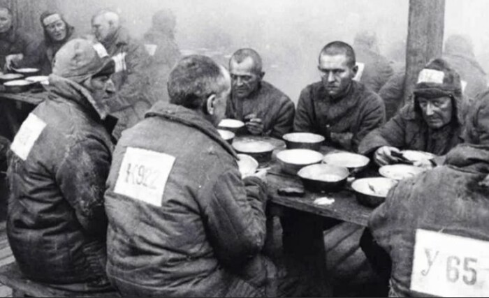

# Менеджер - мама утка

В некоторых организациях есть руководитель - мама утка. Это вовсе не должность, а звание, состояние души и, возможно, форма заботы, доведённая до организационного экстаза. Мама утка следит, чтобы все утята - сотрудники её отдела - шли одним ровным строем: на обед, на кофе-брейк, на корпоратив и даже в бессмысленные митинги. Главное - синхронность. Командный дух, как известно, формируется не в коде и не в архитектуре, а в походе за шаурмой в 13:05.

Особо продвинутые мамы утки применяют инновации. В одной компании HR предложил технику "грудного вскармливания доверия" - чтобы команда чувствовала связь с лидером буквально. Впрочем, чтобы не вызывать дискомфорт, используется накладная грудь (вдохновлённая киноклассикой "Знакомство с Фокерами"). По словам свидетелей, после первого внедрения КПД команды вырос на 200%, а вовлечённость - до полной психологической зависимости.

Теперь утята не просто сотрудники - они семья. Вместе едят, вместе плавают по agile-каналу Slack и дружно квакают на ретроспективах. Независимость и инициатива, конечно, страдают, но мама утка уверена: главное, чтобы все шли рядом, в идеальной синхронизации, даже если направление выбрано в болото.

## Рекомендации для успешных мам уток

1. **Синхронизируйте ритуалы.** Один обед, одно кофе, одно мнение. Раздрай разрушает семейные ценности.
2. **Обеспечьте тактильную вовлечённость.** Приобретите корпоративную накладную грудь в фирменных цветах компании. Это повысит доверие на уровне эндорфинов.
3. **Следите за утятами 24/7.** Камеры, трекеры, корпоративный Telegram-канал "Мама рядом" - всё во имя заботы.
4. **Создавайте иллюзию выбора.** Пусть утята думают, что плывут сами. Главное - чтобы по вашему маршруту.
5. **Не допускайте утиной эмансипации.** Команда, осознавшая, что может жить без мамы, опасна для корпоративной устойчивости.

Так рождаются настоящие корпоративные семьи - тёплые, уютные и с чётким запахом болотца, где всем хорошо, пока не попробуешь вырастить крылья.
