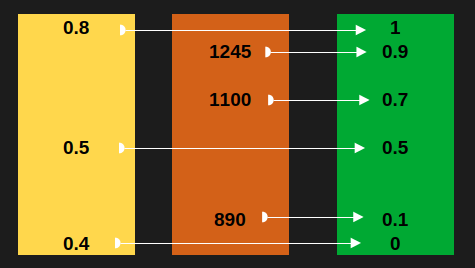

# Масштабируемое слияние рангов - Scaled Rank Fusion

Семейство методов Rank Fusion включает различные алгоритмы объединения нескольких ранжированных списков результатов в один улучшенный ранжированный список с целью повышения качества и надежности итогового ранжирования.

Основная идея — агрегировать информацию из разных систем или моделей, которые могут по-разному оценивать релевантность документов.

Rank Fusion широко применяется в информационном поиске, мультимедийном поиске, гибридных системах поиска, системах на основе модели Retrieval Augmented Generation (RAG), а также в задачах ансамблевого обучения.

Таким образом, Rank Fusion — это семейство алгоритмов разной сложности и подходов, но с единой целью: объединить несколько списков результатов в один, более релевантный и устойчивый к ошибкам ранжирования.

## История рождения Scaled Rank Fusion

В моём последнем проекте я делал гибридный поиск документов для RAG системы.
Для ранжированного поиска мы использовали Elastic Search.

Elastic Search поддерживает метод объединения списков значений [Reciprocal Rank Fusion (RRF)](https://www.elastic.co/docs/reference/elasticsearch/rest-apis/reciprocal-rank-fusion) начиная с версии 8.8 и выше, в том числе версия 8.9 значительно улучшила возможности гибридного поиска с RRF. Метод один, и для его использования нужна лицензия.

Пришлось реализовать самому RRF на бэкенд.

Единственного метода объединения результатов поиска BM25 и векторного поиска в единый ранжированный список документов, мне показалось мало, хотелось иметь больше инструментов для объединения итоговых списков документов.

Изучив вопрос, я с удивлением обнаружил, что самый, на мой взгляд, интуитивно понятный способ объединения списков по их позиции с учётом масштаба шкалы исходных списков, отсутствует в Интернет. По крайней мере я не нашёл ничего похожего на такой метод.

> Идея простая - объединять документы из разных списков в один с учётом их позиции в списках, при этом учитывать масштаб шкалы каждого исходного списка.



Как видно на картинке идея слияния с учётом масштаба проста.

Я дал название для этого метода **Масштабируемое слияние рангов** (Scaled Rank Fusion).

## Как работает масштабируемое слияние рангов

ElasticSearch по разному считает Score для документов в зависимости от типа поиска.

**BM25** вычисляет отдельный score для каждого поискового выражения в запросе.
Итоговый score документа формируется как сумма всех этих частных оценок по каждому запросу. Таким образом, кроме содержимого документа, на итоговый Score сильно влияет, сам поисковый запрос, чем больше в нём операторов поиска, тем больше будет итоговый Score документа.
Диапазон значений Score от 0 до +бесконечности.

При поиске методом **KNN** при использовании метрики близости `cosine similarity` итоговое значение Score будет в диапазоне от -1 до 1 включительно.

Чтобы выполнить слияние рангов необходимо:
1. Нормализовать значение рангов для каждого списка в диапазон от 0 до 1.
2. При наличии одного документа в обоих списках применить для него метод выбора значения ранга, в моём примере это функция Max.
3. Отсортировать документы по рангу.

## Пример реализации метода на C#

```csharp
class Program
{
    private static void Main()
    {
        var listA = new SrfItem[] {
            new SrfItem { Key = "a.a", Weight = 100 },
            new SrfItem { Key = "a.b", Weight = 200 },
            new SrfItem { Key = "a.c", Weight = 800 },
        };

        var listB = new SrfItem[] {
            new SrfItem { Key = "b.a", Weight = 0.1f },
            new SrfItem { Key = "b.b", Weight = 0.12f },
            new SrfItem { Key = "a.c", Weight = 0.3f },
        };

        var mergedList = MergeSrf(listA, listB);

        foreach (var item in mergedList)
        {
            Console.WriteLine($"Key: {item.Key}, Weight: {item.Weight}");
        }
    }

    public class SrfItem
    {
        public required string Key { get; set; }
        public required float Weight { get; set; }
    }

    public static float NormalizeToUnitRange(float value, float min, float max)
    {
        if (min == max)
            throw new ArgumentException("Минимум и максимум не должны быть равны");

        return (value - min) / (max - min);
    }


    public static SrfItem[] MergeSrf(SrfItem[] listA, SrfItem[] listB)
    {
        var listAMaxWight = listA.Max(_ => _.Weight);
        var listAMinWight = listA.Min(_ => _.Weight);
        var listBMaxWight = listB.Max(_ => _.Weight);
        var listBMinWight = listB.Min(_ => _.Weight);

        var scaledListA = listA.Select(_ => new { _.Key, Weight = NormalizeToUnitRange(_.Weight, listAMinWight, listAMaxWight) }).ToArray();
        var scaledListB = listB.Select(_ => new { _.Key, Weight = NormalizeToUnitRange(_.Weight, listBMinWight, listBMaxWight) }).ToArray();

        var mergedList = scaledListA
            .Concat(scaledListB)
            .ToLookup(_ => _.Key, _ => _.Weight)
            .Select(_ => new { _.Key, Weight = _.Max() })
            .ToArray();

        return mergedList
            .OrderByDescending(_ => _.Weight)
            .Select(_ => new SrfItem { Key = _.Key, Weight = _.Weight })
            .ToArray();
    }
}
```