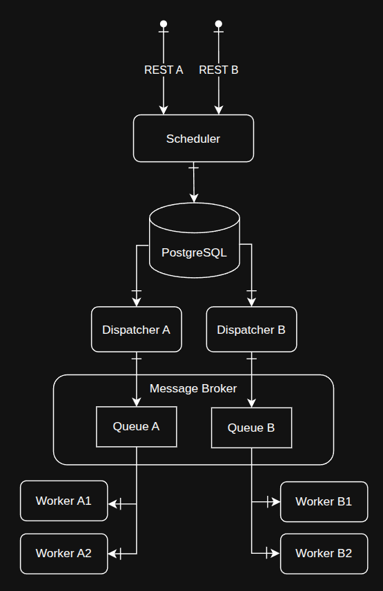

# Архитектура подсистемы управления заданиями

## Введение

Современные распределённые системы часто сталкиваются с задачей управления большим количеством заданий - будь то обработка данных, интеграции или выполнение фоновых задач.

В этой статье рассмотрим архитектуру подсистемы управления заданиями, реализованную на принципах микросервисной архитектуры. Подсистема управляет заданиями на загрузку данных из внешних источников, то есть задачу интеграции с поставщиками данных.

В статье не будет технических деталей, будут даны только принципиально важные детали реализации и критически важные параметры.

## Требования и ограничения

Основная система требует множество данных, которые распределены по разным источникам: файлы на сетевых дисках, файлы в S3, данные из REST API, данные из очереди сообщений. Всего источников насчитывалось несколько десятков, в каждом из них свой формат данных. Нужно было управлять загрузкой данных из этих источников централизованно, максимально надёжно и с соблюдением ограничений.

Поставщики данных имеют строгие ограничения для всех потребителей:
- окна, когда разрешено запрашивать данные,
- максимальное количество обращений за единицу времени.

Все эти ограничения были учтены в архитектуре.

>Сразу отвечу на вопрос, почему не использовалось готовое решение для этой задачи, например Apache NiFi, Apache Airflow, Apache Spark?
>
>Ответ прост - на то были веские причины.

Потребность в свежих данных могла возникнуть в ходе выполнения бизнес операций внутри системы, а значит было недостаточно просто обновлять данные по расписанию.

Исходя из указанных требований родилось решение, которые справляется с задачей, горизонтально масштабируется по производительности и имеет возможность малозатратного подключения новых источников данных в подсистему.

## Общая архитектура

Система разделена на независимые микросервисы, связанные через базу данных, где хранятся готовые задания, и брокер сообщений через который исполнители получают задания которые нужно выполнять.

В основе решения лежат четыре ключевых типа микросервиса: **Scheduler**, **Dispatcher**, **Manager** и **Worker**, каждый из которых отвечает за отдельный этап жизненного цикла задания — от создания до завершения.

На схеме показаны компоненты подсистемы, и потоки данных между ними.



На схеме видны дополнительные штрихи на линиях, нужно пояснить их значение.

## Активный компонент взаимодействия

При передаче данных от одного компонента к другому в данной нотации речь идёт о двух участниках взаимодействия, один из которых играет активную роль, второй пассивную. В этой нотации нет третьей стороны, которая отвечает за перемещение данных между компонентами, инициатором работы по передаче данных всегда выступает один из двух указанных компонентов.

**Дополнительная короткая черта перпендикулярная линии указывает на активный компонент взаимодействия.**

*Пример #1*

```text
А -|---> Б


Компонент `А` передаёт данные компоненту `Б`.

`А` делает push в `Б`.

Например, ваш браузер `А` отправляет картинку на сервер `Б`.
```


*Пример #2*

```text
А ---|-> Б


Компонент `Б` вытягивает данные из компонента `А`.

`Б` делает pull из `А`.

Например, ваш браузер `Б` запрашивает и получает картинку от сервера `А`.
```

>Где почитать подробнее про эту нотацию?
>
>Прямо здесь и читайте, это лично мой приём.

Такая нотация снимает множество вопросов о том, как именно взаимодействуют компоненты, кто из них является инициатором операции передачи данных. Например из схемы видно, что PostgreSQL является пассивным компонентом во всех взаимодействиях, и это самый распространённый сценарий использования СУБД. Чтобы PostgreSQL стал активным компонентом нужно реализовать либо `Job` либо `Trigger`, которые бы делали обращение к другим компонентам, например запрашивали у них данные по http.

## Scheduler

Планировщик - отвечает за добавление новых заданий в подсистему.

Планировщик:

- принимает запросы от внешних клиентов через опубликованные REST API, для каждого типа задания может публиковатся свой REST API, параметры запроса даны в формате понятном клиенту и абстрагируют формат данных и место хранения ресурса - например, клиент не знает, что требуемые данные хранятся в файле или в Elastic, он просто отправляет POST запрос для обновления в системе данных сотрудника:

```json
{
    "object_type": "employee",
    "employee_id": 123,
    "priority": 100
}
```

- валидирует ввод,
- формирует задание согласно настройкам,
- проверяет, что полученное задание не дублирует активную запись в базе,
- сохраняет данные нового задания в базу.

Настройки Scheduler для формирования задания определяют, сколько попыток даётся на выполнение задания, паузы между попытками, приоритет для повторной попытки выполнения задания.

```json
{
    [
        {
            "object_type": "employee",
            "max_try_count": 3,
            "next_try_delay_ms": 60000,
            "next_try_priority": 1000,
        },
        ...
    ]
}
```


## Dispatcher

Диспетчер - самый сложный компонент подсистемы, её "мозг".

Работает по заданному расписанию, во время пауз ничего не делает, во время рабочего периода начинает выбирать активные задания из базы, статус "активно", и передавать их исполнителям. Диспетчер взяв задание в работу присваивает ему статус "в работе", таким образом исключая повторное выпонение заданий.

Пример настроек конфигурации диспетчера для заданий типа `employee`.

```json
{
    "task_type": "employee",
    "work_periods": ["MON-FRI 00:00-06:00", "MON-FRI 18:00-22:00", "SAT-SUN 00:00-23:59"],
    "task_max_batch_size": 1,
    "next_task_batch_delay_ms": 1000,
}
```

Параметр `task_max_batch_size` задаёт количество заданий, которые диспетчер передаёт в работу исполнителям, чем больше исполнителей ожидают новых задач, тем большим должно быть значение параметра.

Каким образом Диспетчер узнаёт, что предыдущий пакет заданий выполнен и можно отправлять новый?

В текущей реализации используется алгоритм, который перед шагом отбора заданий для исполнения проверяет, что в базе данных не осталось записей заданий в статусе "в работе", разумеется для указанного типа. Таким образом Диспетчер убеждается, что все задачи из предыдущего пакета были либо успешно завершены, либо закончились с ошибкой и были закрыты или перепланированы Менеджером. Перед шагом планирования Диспетчер делает паузу, длительность которой указана в настройках в параметре `next_task_batch_delay_ms`.

## Worker

Исполнитель - выполняет рабочее задание.

Ответственность исполнителя - выполнить задание и сообщить Менеджеру через очередь сообщений о результате, о том успешно ли выполнено задание или с ошибкой.


## Manager

Менеджер задач - контролирует пул заданий в базе и управляет состоянием задач.

Менеджер получает от Исполнителей уведомления о результате выполнения заданий. При успешном завершении задания, Менеджер закрывает его - присваивает статус "выполнено". Если задание завершилось с ошибкой, то Менеджер увеличивает счётчик попыток выполнения задания и если лимит попыток ещё не превышен, то меняет заданию приоритет на значение `next_try_priority` и присваивает статус "активно", а для заданий с ошибкой, которые исчерпали лимит попыток, присваивает статус "завершено с ошибкой".

Также Менеджер согласно настроек может периодически оптимизировать пул заданий в бвзе - удаляя старые записи и выполняя иные сервисные функции для оптимизации пула заданий - поиск и удаление дублей, запись ошибок исполнения в отдельный лог, уведомление об ошибках и тому подобное.

## Типы заданий

Выше было упомянуто, что каждое задание имеет свой тип, например тип "employee" - это задания на обновление данных о сотруднике. В данной архитектуре можно добавлять любое количество типов заданий.

## Программные модули

На схеме показано, что для каждого типа задания создаётся набор микросервисов, а именно Scheduler, Dispatcher, Worker.
В текущей реализации Dispatcher не содержит уникальной логики для каждого типа задания, поэтому в коде это один компонент для всех типов заданий, который при запуске получает флаг с указанием с каким типом задания работает экземпляр процесса Dispatcher.

Например:

```bash
./dispatcher.exe -t "employee"
```

Компоненты Scheduler и Worker имеют уникальные реализации для каждого типа задания, что логично.

Структура хранилища заданий в базе данных и формат сообщений от Worker для Manager - унифицированы.

Такая архитектура позволяет подключать (а также останавливать или удалять) типы заданий "на горячую" без остановки работы всей подсистемы в целом.

## О производительности

Подсистема не проектировалась для максимальной производительности, фокусом было - обеспечить надёжное обновление данных строго в разрешённых каждым источником данных интервалах времени. Узким местом для подсистемы всегда является сам источник данных, скорость работы которого в разы меньше скорости работы остальных компонентов подсистемы.

Тем не менее, архитектура имеет хороший потенциал для применения в задачах с высокой производительностью.

Worker-ы уже хорошо масштабируются горизонтально.

Для горизонтального масштабирования Scheduler-ов, нужен только балансировщик, что в Kubernetes выполняется настройками.

Узкое место - база данных, для повышения производительности может потребовать определённые приёмы увеличения производительности, например дублирование таблиц с заданиями для каждого типа задания и привязка таблиц к разным разделам файловой системы на быстрых дисках, наконец создание для каждого типа задания отдельной базы данных на отдельных узлах. Также будет полезным пересмотреть `data flow` и структуру таблиц базы данных с целью минимизации операций записи в базу данных или хотя бы снижения размера записи с часто обновляемыми данными, их более компактного размещения в памяти, и как следствие уменьшения количества ошибок операционной системы `page fault`.

Dispatcher потребует изменения алгоритма планирования на, к примеру, двойной буфер и реализацию быстрых проверок остатка невыполненных заданий не в базе данных, как сейчас, а в очереди Message Broker.