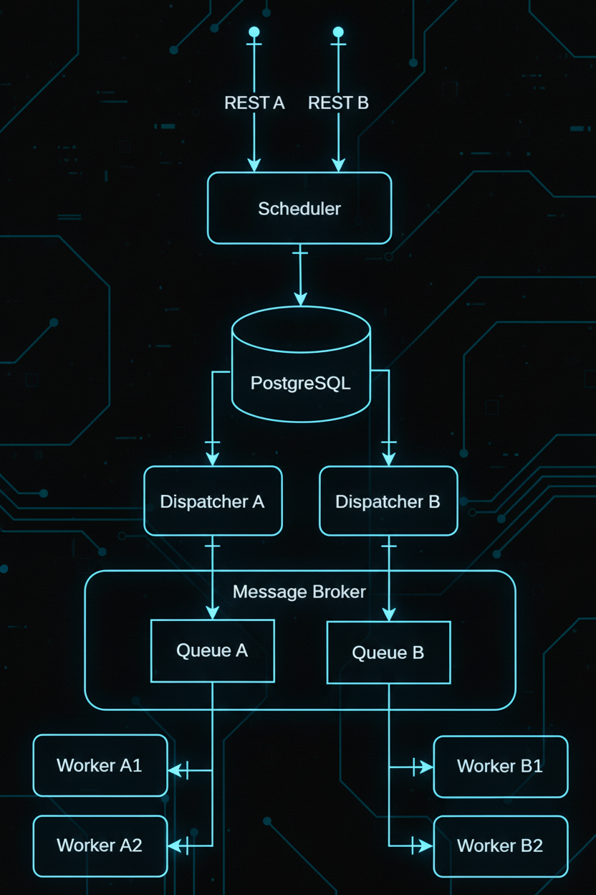

# Архитектура подсистемы управления заданиями

## Введение

Современные распределённые системы часто сталкиваются с задачей управления большим количеством заданий - будь то обработка данных, интеграции или выполнение фоновых задач.

В этой статье рассмотрим архитектуру подсистемы управления заданиями, реализованную на принципах микросервисной архитектуры. Подсистема управляет заданиями на загрузку данных из внешних источников, то есть задачу интеграции с поставщиками данных.

## Требования и ограничения

Основная система требует множество данных, которые распределены по разным источникам: файлы на сетевых дисках, файлы в S3, данные из REST API, данные из очереди сообщений. Всего источников насчитывалось несколько десятков, в каждом из них свой формат данных. Нужно было управлять загрузкой данных из этих источников централизованно, максимально надёжно и с соблюдением ограничений.

Поставщики данных имеют строгие ограничения для всех потребителей:
- окна, когда разрешено запрашивать данные,
- максимальное количество обращений за единицу времени.

Все эти ограничения были учтены в архитектуре.

>Сразу отвечу на вопрос, почему не использовалось готовое решение для этой задачи, например Apache NiFi, Apache Airflow, Apache Spark?
>
>Ответ прост - на то были веские причины.

Потребность в свежих данных могла возникнуть в ходе выполнения бизнес операций внутри системы, а значит было недостаточно просто обновлять данные по расписанию.

Исходя из указанных требований родилось решение, которые справляется с задачей, горизонтально масштабируется по производительности и имеет возможность малозатратного подключения новых источников данных в подсистему.

## Общая архитектура

Система разделена на независимые микросервисы, связанные через базу данных, где хранятся готовые задания, и брокер сообщений через который исполнители получают задания которые нужно выполнять.

В основе решения лежат три ключевых микросервиса: **Scheduler**, **Dispatcher** и **Worker**, каждый из которых отвечает за отдельный этап жизненного цикла задания — от создания до завершения.

На схеме показаны компоненты подсистемы, и потоки данных между ними.



На схеме видны дополнительные штрихи на линиях, нужно пояснить их значение.

## Активный компонент взаимодействия

При передаче данных от одного компонента к другому в данной нотации речь идёт о двух участниках взаимодействия, один из которых играет активную роль, второй пассивную. В этой нотации нет третьей стороны, которая отвечает за перемещение данных между компонентами, инициатором работы по передаче данных всегда выступает один из двух указанных компонентов.

>Вертикальная черточка указывает на активный компонент взаимодействия.

**Пример #1**

```text
А -|---> Б
```

Компонент `А` передаёт данные компоненту `Б`.

`А` делает push в `Б`.

Например, ваш браузер `А` отправляет картинку на сервер `Б`.

**Пример #2**

```text
А ---|-> Б
```

Компонент `Б` вытягивает данные из компонента `А`.

`Б` делает pull из `А`.

Например, ваш браузер `Б` запрашивает и получает картинку от сервера `А`.

>Где почитать подробнее про эту нотацию?
>
>Прямо здесь и читайте, это лично мой приём.

Такая нотация снимает множество вопросов о том, как именно взаимодействуют компоненты, кто из них является инициатором операции передачи данных. Например из схемы видно, что PostgreSQL является пассивным компонентом во всех взаимодействиях, и это самый распространённый сценарий использования СУБД. Чтобы PostgreSQL стал активным компонентом нужно реализовать либо `Job` либо `Trigger`, которые бы делали обращение к другим компонентам, например запрашивали у них данные по http.

## Scheduler

Планировщик - отвечает за добавление новых заданий в подсистему.

Планировщик:

- принимает запросы от внешних клиентов через опубликованные REST API, для каждого типа задания может публиковатся свой REST API, параметры запроса даны в формате понятном клиенту и абстрагируют формат данных и место хранения ресурса - например, клиент не знает, что требуемые данные хранятся в файле или в Elastic, он просто отправляет POST запрос для обновления в системе данных сотрудника:

```json
{
    "object_type": "employee",
    "employee_id": 123
}
```

- валидирует ввод,
- проверяет, что полученное задание не дублирует активную запись в базе,
- сохраняет данные нового задания в базу.

## Dispatcher

Диспетчер - самый сложный компонент подсистемы.

Диспетчер — это мозг подсистемы. Он анализирует очередь активных заданий, применяет правила приоритезации и распределяет задачи между доступными исполнителями. Помимо этого, он регулирует интенсивность выполнения — контролирует число активных исполнителей и их загрузку. Для коммуникации используется брокер сообщений (например, Kafka или RabbitMQ), что обеспечивает масштабируемость и устойчивость к временным сбоям службы-исполнителя. Встроенные метрики позволяют динамически корректировать параметры пула исполнителей.


## Worker


