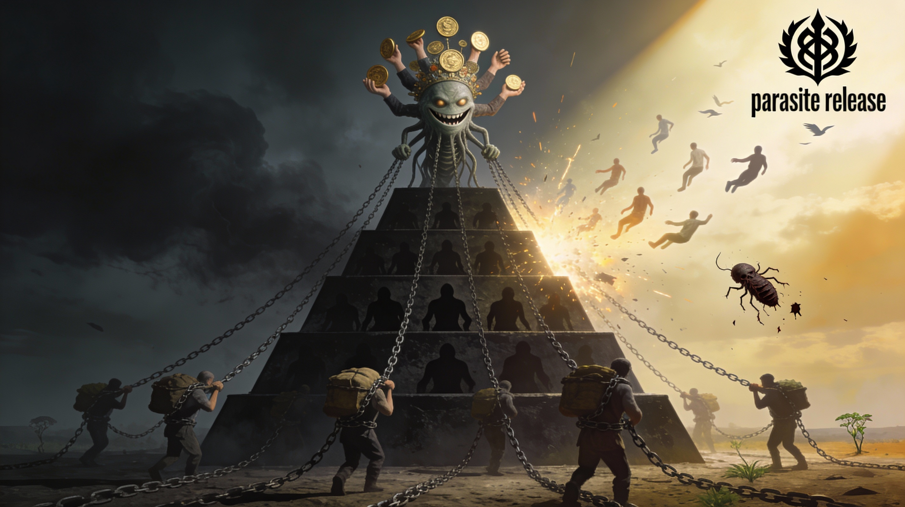

# Почему паразиты побеждают

Мы привыкли считать, что вершины любой иерархии должны занимать лучшие - компетентные, трудолюбивые, ответственные. Но взгляд на реальность разрушает этот идеал, нередко наверху оказываются те, кто живёт за чужой счёт, манипулирует, перекладывает ответственность и использует других как ресурс. Кажется, будто система сама вознаграждает паразитов. Почему так происходит?

## Разная природа мотивации

Главное различие между честным тружеником и человеком паразитического склада - источник их мотивации.

Честный человек мотивирован самим процессом: он делает свою работу хорошо, ценит результат, стабильность и внутреннее спокойствие. Но именно эта стабильность и становится ловушкой: его завтра похоже на вчера, усилия не ведут к качественному изменению положения. Он не стремится ломать правила - и потому остаётся в их границах.

Паразит же движим противоположным вектором. Его цель - взять чужое, обойти систему, подчинить других своей воле. Он чувствует азарт борьбы и вкус к риску, потому что каждая победа даёт не только выгоду, но и ощущение превосходства. Для него любая иерархия - поле охоты, где он ищет лазейки, связи, слабости конкурентов. Такая внутренняя энергия делает его напористым, гибким, готовым к интригам и конфронтации, готовым использовать всё, чего избегает честный человек.

## Социальная экосистема и закон выживания

В  античном Риме "паразитами" (parasiti) звали льстецов и шутов при знатных домах. Они получали еду, подарки и покровительство не за труд, а за умение развлекать и угождать хозяину - "кормить лестью". Знатные римляне обедали в их окружении, вознаграждая показную преданность.

Типаж паразита стал классическим персонажем римской комедии. Он изображался как человек острого ума, но готовый на любое унижение ради хорошего ужина.

Именно из этой античной практики "нахлебничества" позже возник современный смысл термина в биологии и социологии.

Как и в природе, в обществе выживают не "самые полезные", а "самые приспособленные".
Паразитические формы поведения устойчивы, потому что они эволюционно выгодны: они максимизируют результат при минимальных затратах. В бюрократической или корпоративной пирамиде такая стратегия особенно эффективна - ведь существующая система сама поощряет внешние признаки успеха, а не усилия, которые за ним стоят.

Трудолюбие остаётся невидимым, а агрессивное продвижение - заметным. Паразит редко создаёт ценность, но умеет присваивать её - и общество, ориентированное на видимость успеха, награждает именно таких.
​
## Биологический механизм - регуляция и истощение хозяина

В экосистемах паразиты занимают свою нишу - регулируют численность хозяина, предотвращая избыточный рост и как следствие истощение кормовой базы, что в целом делает экосистему более устойчивой и стабильной.

Однако, чрезмерный паразитизм ограничивает развитие экосистемы. Паразиты снижают репродуктивный успех хозяина, изменяя поведение или фенотип (например, трематоды заставляют улиток светлеть, делая их уязвимыми для хищников). Это стабилизирует популяцию, но тормозит её экспансию - хозяин не размножается агрессивно. В симбиотических системах сильный паразитизм вызывает "коэкстинкцию" (совместное вымирание), блокируя миграцию и адаптацию группы в новые ниши. Группа хозяин-паразит самоограничивается, её ресурсы тратятся на выживание, а не на рост.

В человеческих группах паразитическая элита (элита, живущая за счёт остальных) подавляет развитие, фокусируясь на перераспределении, а не создании ценности. Как следствие проявляется снижение мотивации к инновациям, члены группы знают, что их усилия присвоят "паразиты", желание рисковать и проявлять креативность уменьшается. Группа застаивается, не расширяясь. Фокус на перераспределении ценностей приводит к перегрузке системы налогами, штрафами и другими "законными" способами перераспределить ценность в пользу элит. Такая политика снижает инвестиции в будущее, включая рождаемость. Развитие становится невозможным без внешних ресурсов. Паразиты устраняют конкурентов, группа теряет разнообразие, что снижает адаптивность и приводит группу в эволюционный тупик.

## Почему система не самоочищается

Иерархические управленческие структуры системы, поражённой поразитами, не способны спонтанно очиститься от паразитов, потому что каждый новый уровень структуры управления создаёт фильтр, настроенный таким образом, что через него легче пройти некомпетентному манипулятору, чем результативному исполнителю.

Тот, кто готов использовать любые средства не считаясь с какими либо идеями и нормами, тот быстрее продвигается и начинает влиять на фактические критерии оценки для других людей. Система таким образом самовоспроизводится - паразит выбирает похожих на себя приспособленцев, льстецов и манипуляторов.

## Созидательная мотивация - альтруизм редкая не аномалия

Парадокс в том, что созидательная мотивация - стремление не просто добиться выгоды, а улучшить действительность - слабо подкреплена биологически. Альтруизм даёт преимущество над эгоизмом в конкретных конструкциях групп, где для выживания важнее межгрупповая конкуренция или кооперация, а не внутригрупповой эгоизм. Это подтверждено моделями эволюционной биологии: [родственный отбор](https://ru.wikipedia.org/wiki/%D0%A0%D0%BE%D0%B4%D1%81%D1%82%D0%B2%D0%B5%D0%BD%D0%BD%D1%8B%D0%B9_%D0%BE%D1%82%D0%B1%D0%BE%D1%80) и [групповой отбор](https://ru.wikipedia.org/wiki/%D0%93%D1%80%D1%83%D0%BF%D0%BF%D0%BE%D0%B2%D0%BE%D0%B9_%D0%BE%D1%82%D0%B1%D0%BE%D1%80).

Интересно рассмотреть вопрос альтруизма и эгоизма с научной точки зрения:
[Лаверычева И. Г. Альтруизм и эгоизм с естественнонаучной точки зрения // Биосфера. 2016. №3](https://cyberleninka.ru/article/n/altruizm-i-egoizm-s-estestvennonauchnoy-tochki-zreniya).

Эволюция напрямую не вознаграждает тех, кто работает ради общего блага или смысла - она поддерживает тех, кто эффективнее выживает и размножается. Поэтому людей с внутренней потребностью творить, а не потреблять, всегда значительно меньше. Их мотивация не питается животным страхом или жаждой власти - она требует осознанности, силы воли и постоянного внутреннего поддержания.

>Если реакции эгоизма сконцентрированы на себе и, большей частью, происходят автоматически, без участия сознания, то реакции альтруизма и у животных, и у человека, преимущественно, требуют работы мышления, они связаны со способностью представить себя на месте другого, чтобы стало возможным проявление сочувствия и сострадания.
>
>"Лаверычева И. Г. Альтруизм и эгоизм с естественнонаучной точки зрения"

Именно поэтому борьба альтруистов-созидателей за свои цели затруднена - они идут против естественного течения инстинктов и против логики систем, выстроенных законами эволюциии. Но при этом только они способны менять правила игры - быть началом чего-то нового, пусть и ценой личных потерь.

## Осознанность против инстинкта

Паразиты побеждают, потому что играют на полях, где действуют базовые биологические механизмы - борьба за ресурс и власть.

Созидатели проигрывают, потому что выходят за пределы базовой биологии, руководствуются групповой, а не личной выгодой. Однако именно их осознанность и самоотречение - единственное, что способно изменить траекторию цивилизации.

Есть редкий феномен освобождения от паразита "Parasite Release": процесс, когда популяция паразита гибнет, сохраняя хозяина. Это происходит, если паразит не успевает эволюционировать вместе с меняющимся хозяином. Тогда паразит вымирает в новой среде, освобождая хозяина для роста и экспансии.

Пока человек не научится различать в себе паразита и творца, пока общество не создаст условия для "Parasite Release", пока общество не начнёт поощрять смысл, а не только успех - мир останется ареной для тех, кто умеет брать, но не давать.

И если у созидательного меньшинства хватит воли объединится и мужества не отступить, то, возможно, однажды "паразитическая" эволюция уступит место человеческой.